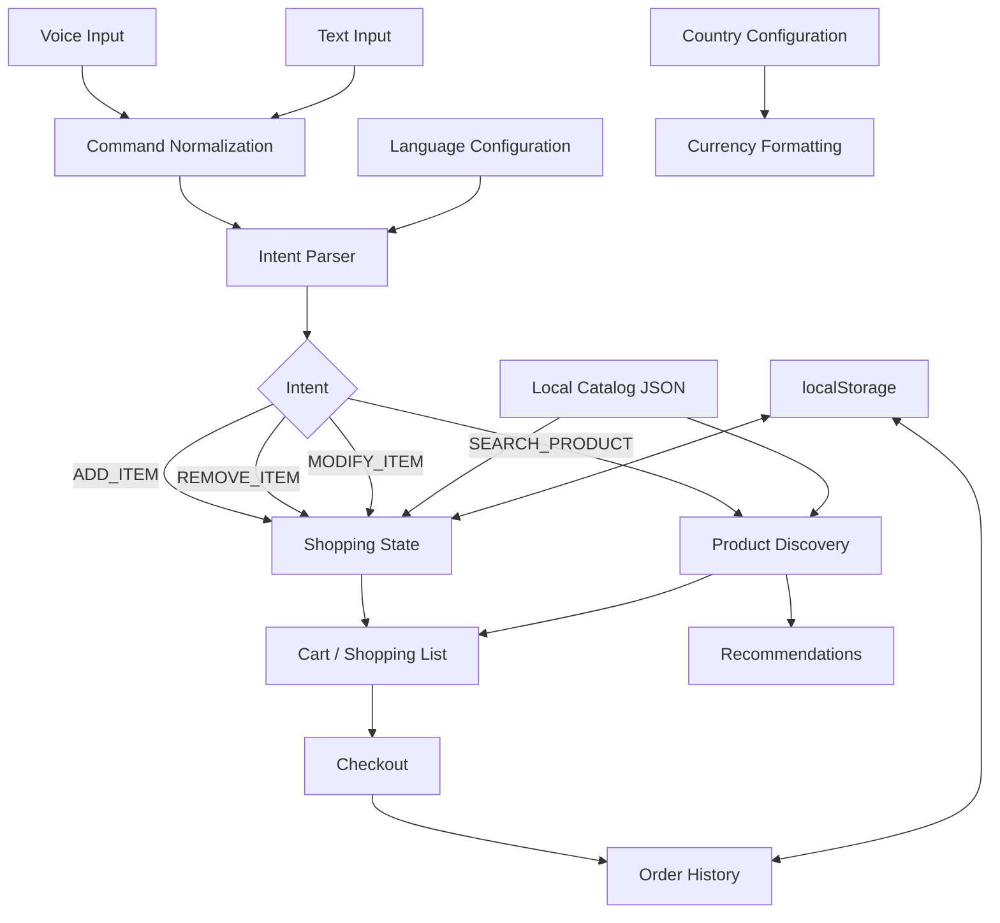

# Groci

> Shop smarter. Just speak.

## Overview

Groci is a multilingual grocery shopping assistant that allows users to speak or type natural-language shopping commands.

Commands are interpreted locally and routed through a shared intent-processing pipeline that can add, remove, modify, or search for products.

The application also provides product discovery, recommendations, cart management, demo checkout, order history, country-aware currency formatting, and theme/language support.

## Features

### Voice Shopping
- Natural-language voice commands
- Browser Web Speech API
- Final transcript processing
- Implicit shopping commands

Example:

"add two bottles of milk"

"2 apples"

"please put 3 bananas in my list"

### Text Shopping
- Same command-processing pipeline as voice
- Natural-language text input

### Product Discovery
- Categories
- Search
- Brand
- Size
- Price
- Availability
- Sale filtering

### Smart Recommendations
- Buy Again
- Seasonal
- On Sale
- Alternatives

### Cart & Checkout
- Quantity controls
- Subtotal/total
- Demo checkout
- Order confirmation
- Local order history

### Internationalization
- English
- Hindi
- Marathi
- Tamil

*Note: Voice recognition support depends on your browser and OS. If a language is unsupported for voice in your browser, the app will gracefully fallback to text input.*

### Themes
- Light
- Dark
- System

### Currency
- Country-aware formatting using `Intl.NumberFormat`
- Sample catalog pricing
- No live exchange-rate API

## Tech Stack

- React
- TypeScript
- Vite
- Tailwind CSS
- Web Speech API
- Vitest
- localStorage

## Architecture

